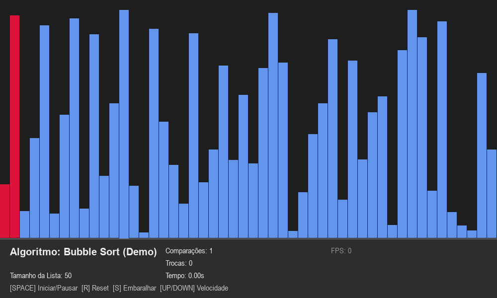

# SortViz 📊

[](https://www.python.org/downloads/)
[](https://opensource.org/licenses/MIT)
[](https://github.com/reylanbit/the-one/actions)
[](https://github.com/reylanbit/the-one)

**SortViz** é uma ferramenta interativa e educativa para aprender algoritmos de ordenação vendo eles "dançarem" na sua tela. Com animações coloridas, feedback sonoro e métricas em tempo real, o SortViz transforma o estudo de estruturas de dados em uma experiência visual fascinante.

---

## 📺 Demonstração



*Nota: Se o arquivo `demo.gif` não estiver visível, você pode gerá-lo executando `python generate_gif.py`.*

---

## ✨ Funcionalidades Principais

- ✅ **Visualização Colorida**: Barras que mudam de cor conforme o estado (comparação, troca, ordenado).
- ✅ **5 Algoritmos Clássicos**: Bubble, Selection, Insertion, Quick e Merge Sort.
- ✅ **Controle de Velocidade**: De 0.5x (didático) até 50x (turbo).
- ✅ **Feedback Sonoro**: Bips gerados dinamicamente para cada operação.
- ✅ **Casos Especiais**: Gere listas aleatórias, reversas ou quase ordenadas com um clique.
- ✅ **Modo Passo a Passo**: Avance manualmente para entender cada detalhe.
- ✅ **Métricas em Tempo Real**: Contador de comparações, trocas e tempo decorrido.

---

## 📸 Capturas de Tela

| Interface Principal (Estático) | Algoritmos em Ação (Animado) |
|:---:|:---:|
|  |  |


---

## 🚀 Como Executar

### 1. Clonar o repositório
```bash
git clone https://github.com/reylanbit/the-one.git
cd the-one
```

### 2. Configurar o ambiente

**Windows:**
```powershell
./setup_development.bat
venv\Scripts\activate
```

**macOS / Linux:**
```bash
python3 -m venv venv
source venv/bin/activate
pip install -r requirements.txt
```

### 3. Rodar o SortViz
```bash
python -m src.main
```

---

## ⌨️ Como Usar

- **ESPAÇO**: Iniciar ou Pausar a animação.
- **SETAS CIMA/BAIXO**: Ajustar a velocidade da ordenação.
- **SETA DIREITA**: Avançar um único passo (quando pausado).
- **R**: Resetar a lista para o estado original.
- **S**: Embaralhar e gerar uma nova lista aleatória.
- **Teclas 1 a 5**: Selecionar o algoritmo de ordenação.
- **A / Z / F**: Gerar casos especiais (Quase ordenada, Reversa, Poucos valores).

---

## 📈 Tabela de Complexidade

| Algoritmo | Melhor Caso | Médio Caso | Pior Caso | Espaço Extra |
| :--- | :---: | :---: | :---: | :---: |
| **Bubble Sort** | $O(n)$ | $O(n^2)$ | $O(n^2)$ | $O(1)$ |
| **Selection Sort** | $O(n^2)$ | $O(n^2)$ | $O(n^2)$ | $O(1)$ |
| **Insertion Sort** | $O(n)$ | $O(n^2)$ | $O(n^2)$ | $O(1)$ |
| **Merge Sort** | $O(n \log n)$ | $O(n \log n)$ | $O(n \log n)$ | $O(n)$ |
| **Quick Sort** | $O(n \log n)$ | $O(n \log n)$ | $O(n^2)$ | $O(\log n)$ |

---

## 📂 Estrutura do Projeto

```text
SortViz/
├── src/
│   ├── algorithms/      # Lógica dos algoritmos (Bubble, Quick, etc)
│   ├── visualization/   # Motor Pygame (Drawer e Controller)
│   └── utils/           # Geradores, Métricas e SoundManager
├── tests/               # Testes unitários com Pytest
├── docs/                # Documentação teórica detalhada
├── generate_gif.py      # Script para criar a demo animada
└── run_tests.bat        # Executor de testes com relatório de cobertura
```

---

## 🤝 Contribuindo

Interessado em ajudar? Confira nosso [CONTRIBUTING.md](CONTRIBUTING.md) para saber como começar.

---

## 📄 Licença

Este projeto está licenciado sob a **Licença MIT** - veja o arquivo [LICENSE](LICENSE) para mais detalhes.

---

## 🙏 Agradecimentos

- [Pygame](https://www.pygame.org/) - Pela excelente biblioteca de jogos.
- [Shields.io](https://shields.io/) - Pelos badges incríveis.
- Inspirado em visualizadores clássicos de algoritmos da comunidade open-source.

---
*Desenvolvido com ❤️ por [reylanbit](https://github.com/reylanbit)*
